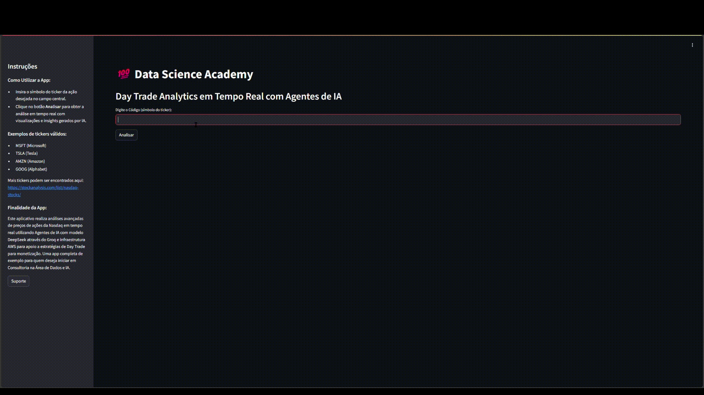

# Day Trade Analytics App

Este projeto demonstra uma aplicação de analytics em tempo real para Day Trade construída com Streamlit, Plotly e agentes de IA integrados via Groq. Também inclui código Terraform para provisionar EC2 e S3 na AWS, além de scripts e um Dockerfile para execução local ou em contêiner.


---

## 🚀 Destaques
- Aplicação de analytics em tempo real usando Yahoo Finance (`yfinance`) e visualizações interativas (`plotly`, `streamlit`).
- Integração com agentes de IA (Groq, DuckDuckGo, YFinance tools) para recomendações e enriquecimento com pesquisa na web.
- Infraestrutura como código (Terraform) com módulos para S3, IAM, EC2 e Security Group.
- Ambiente em contêiner (`Dockerfile`) com Terraform e AWS CLI pré-instalados.

---

## Índice
1. [Demonstração / Capturas de Tela](#-demonstração--capturas-de-tela)
2. [Tecnologias](#-tecnologias)
3. [Arquitetura](#-arquitetura)
4. [Execução Local (Desenvolvimento)](#-execução-local-desenvolvimento)
5. [Execução em Docker](#-execução-em-docker)
6. [Deploy na AWS (Terraform)](#-deploy-na-aws-terraform)
7. [Estrutura do Projeto](#-estrutura-do-projeto)
8. [Arquivos e Módulos Principais](#-arquivos-e-módulos-principais)
9. [Recursos / O que foi implementado](#-recursos--o-que-foi-implementado)
10. [Melhorias Futuras e Roadmap](#-melhorias-futuras-e-roadmap)
11. [Sobre / Contato](#-sobre--contato)

---

## 📺 Demonstração



---

## 🧭 Tecnologias
- Python 3.11+ (aplicação Streamlit)
- Streamlit (UI da aplicação)
- Plotly (visualizações interativas)
- yfinance (dados históricos de ações)
- Groq (integração com modelos de IA)
- Terraform (IaC)
- AWS (S3, EC2, IAM)
- Docker (ambiente containerizado)

---

## 🏗 Arquitetura
Fluxo da aplicação:
- O app Streamlit `iac/app/dsa_app.py` busca dados de ações via `yfinance` e renderiza gráficos com Plotly.
- Agentes de IA são implementados com `phi.agent` e `Groq` para gerar recomendações e sumarizações.
- Arquivos e scripts são enviados para o S3 via os módulos Terraform em `iac/modules/s3`.
- Instâncias EC2 são provisioonadas via `iac/modules/ec2-instances` e recebem um `instance_profile` (IAM) para acessar o bucket S3.
- Um script de inicialização (`user_data`) baixa os arquivos do S3 e executa o aplicativo Streamlit.

---

## 🧪 Execução Local (Desenvolvimento)
Esses passos são para desenvolvimento local (sem AWS):

1. Crie e ative um ambiente virtual:

```powershell
python -m venv .venv
.\.venv\Scripts\Activate.ps1
```

2. Instale as dependências:

```powershell
pip install --upgrade pip
pip install -r iac\scripts\requirements.txt
```

3. Execute o app Streamlit localmente:

```powershell
cd iac\app
streamlit run dsa_app.py
```

4. Abra o navegador em http://localhost:8501 e digite um ticker (por exemplo, MSFT, TSLA).

---

## 🐳 Execução em Docker
Construa e execute a imagem Docker que já inclui Terraform e AWS CLI. Útil para ambientes reproduzíveis ou quando o host não possui as dependências necessárias.

```powershell
# Construir a imagem (da raiz do repositório)
docker build -t app-image:latest .

# Executar o container e montar a pasta iac em /iac
docker run -dit --name app-p1 -v ${PWD}:/iac app-image:latest /bin/bash

# A partir do container, você pode executar comandos terraform e aws,
# ou iniciar o Streamlit se preferir.
```

---

## 🔧 Deploy na AWS (Terraform)
Este repositório inclui configurações Terraform em `iac/` para:
- Criar um bucket S3 (com versionamento e upload de objetos)
- Criar IAM policy e role para permitir que a EC2 acesse o bucket S3
- Criar um Security Group (portas 80, 8501 e 22)
- Criar uma instância EC2 que baixa e executa o Streamlit a partir do S3

Antes de aplicar o Terraform, certifique-se de ter as credenciais AWS (via ambiente ou `~/.aws/credentials`).

Comandos básicos (a partir da pasta `iac`):

```powershell
cd iac
terraform init
terraform plan -var "name_bucket=nome-unico-do-bucket" -var "groq_api_key=SUA_CHAVE_GROQ"
terraform apply -var "name_bucket=nome-unico-do-bucket" -var "groq_api_key=SUA_CHAVE_GROQ" -auto-approve
```

Notas:
- A aplicação usa `Groq` e necessita da chave da API (Groq) configurada como variável Terraform; proteja este valor.
- O módulo S3 fará upload dos arquivos nas pastas `iac/app` e `iac/scripts` para o bucket criado.
- O Security Group permite a porta 8501, usada pelo Streamlit.

---

## 📁 Estrutura do Projeto
```
./
├─ Dockerfile
├─ LEIAME.txt
├─ iac/
│  ├─ app/dsa_app.py
│  ├─ scripts/bash_file.sh
│  ├─ scripts/requirements.txt
│  ├─ main.tf
│  ├─ variables.tf
│  └─ modules/
│     ├─ s3/
│     ├─ iam/
│     ├─ ec2-instances/
│     └─ security-group/
```

---

## 📂 Arquivos e Módulos Principais
- `iac/app/dsa_app.py` — Código do app (Streamlit). Busca dados com yfinance, aplica agentes de IA e exibe gráficos com Plotly.
- `iac/scripts/bash_file.sh` — Script de inicialização que configura o ambiente e inicia o Streamlit na EC2.
- `iac/modules/s3` — Cria bucket S3 e faz upload dos arquivos do app.
- `iac/modules/iam` — Cria roles e políticas para a EC2 acessar o S3.
- `iac/modules/ec2-instances` — Cria instância EC2 e associa perfil de instância.
- `Dockerfile` — Imagem Ubuntu com Terraform e AWS CLI pré-instalados.

---

## 🔮 Recursos & O que foi implementado
- Aplicação Streamlit interativa para acompanhamento de ações e gráficos candlestick.
- Integração com agentes de IA (Groq) para enriquecer a análise com notícias e recomendações.
- Infraestrutura provisionada com Terraform para automação do deploy na AWS.

---

## 📈 Melhorias Futuras & Roadmap
- Adicionar testes automatizados para a UI e para a coleta de dados (mock yfinance).
- Criar CI/CD (GitHub Actions) para build de imagem Docker e `terraform plan` com validações.
- Implementar HTTPS, balanceador de carga e escalabilidade (ou migração para ECS/EKS).
- Melhorar cache e análise histórica; persistir dados em um banco de dados gerenciado (RDS ou DynamoDB).

---

## 👤 Sobre / Contato
Projeto de demonstração de Data Science & DevOps.

---


